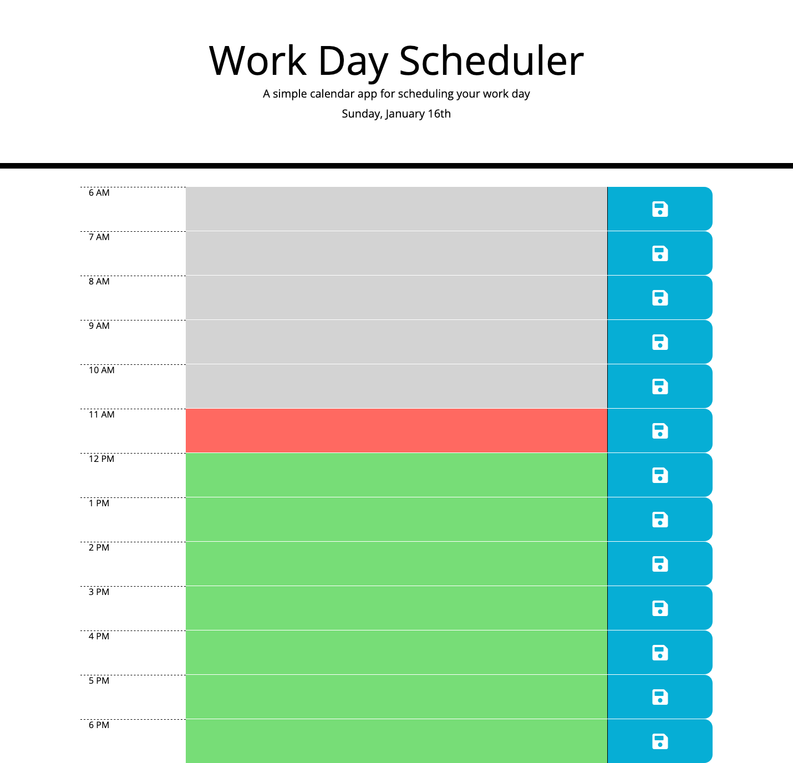

# Work Day Scheduler

## Description

As both a student and a full-time employee with a very busy schedule, I need a daily planner so that I can effectively manage both my workload and schoolwork. Effective time management will help me meet deadlines.

In building this project, I learned how to use jQuery, Bootstrap 4, Font Awesome, and Moments.js.

## Usage

Click on a time block and add tasks or activities that need to be completed during that hour. Click on the save button to save new or edited tasks. Clicking anywhere but the save button will discard any changes and keep the original task info (or lack thereof).

## Live Site

[Work Day Scheduler](https://brookescodestuff.github.io/workday-scheduler/)

## Screenshot

